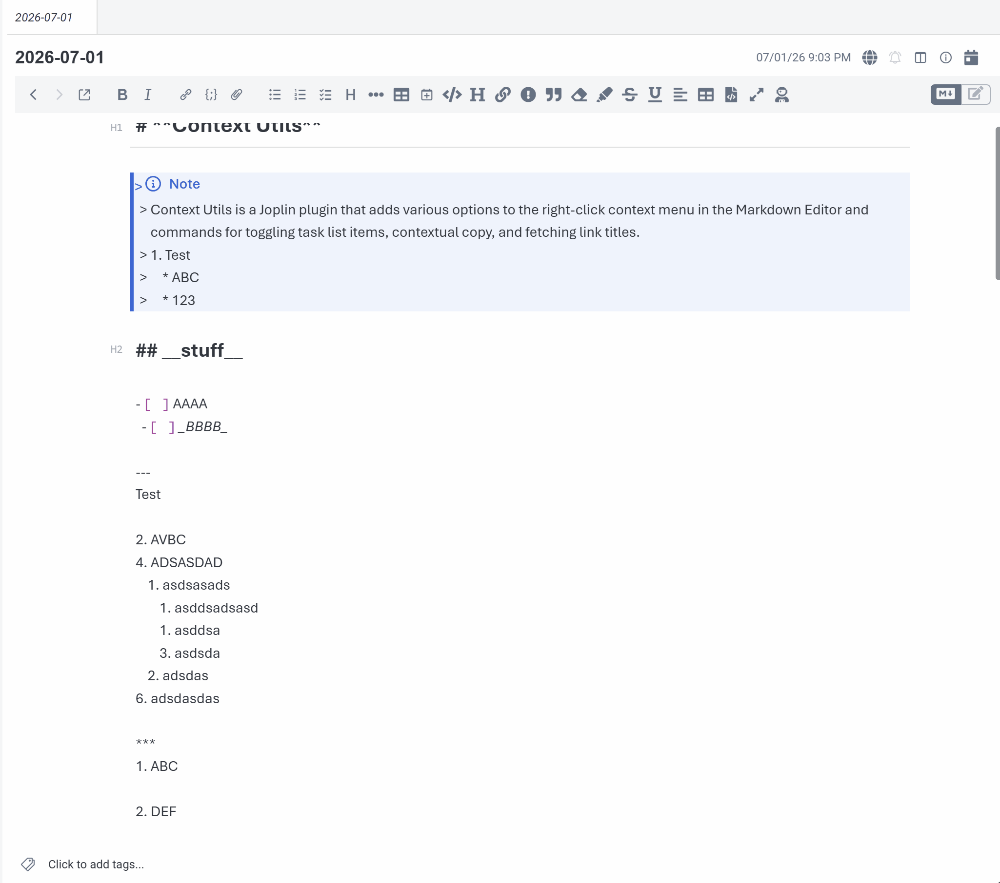

> [!NOTE]
> This plugin was created entirely with AI tools.

> [!NOTE]
> This plugin only works in the Markdown editor.

# Markdown Formatter

A Joplin plugin that formats the current note's Markdown with some configurable rules.

The plugin parses Markdown to find
known structures, then applies targeted edits to the original text. Syntax it does not explicitly
understand is left alone.



## Features

- Normalize unordered list markers to `-` or `*`.
- Renumber ordered lists sequentially while preserving the first item's number.
- Normalize emphasis and bold delimiters.
- Normalize heading levels so they increase by at most one level at a time.
- Preserve, tighten (when list doesn't contain block content), or loosen list spacing.
- Normalize nested list indentation with tabs, 2 spaces, or 4 spaces.
- Normalize Horizontal rule format and spacing above/below.
- Optionally align GitHub Flavored Markdown tables.
- Ensure headings have a blank line before and after neighboring content.
- Collapse repeated blank lines outside protected content.
- Ensure the note ends with exactly one trailing newline.
- Apply changes through CodeMirror so formatting is undoable with Joplin's normal undo command.

## Usage

Install the plugin, open a Markdown note, then:

- `Edit -> Format Markdown`
- `Ctrl+Alt+F` on Windows/Linux
- `Cmd+Alt+F` on macOS
- Click `Format Markdown` button in the formatting toolbar

The command formats the currently open note. If the note is already formatted, it does not write the note
back.

## Settings

Settings are available under `Markdown Formatter` in Joplin's plugin settings.

| Setting                            | Default             | Description                                                             |
| ---------------------------------- | ------------------- | ----------------------------------------------------------------------- |
| Unordered list marker              | `-`                 | Rewrite unordered bullets to dash or asterisk.                          |
| Normalize ordered list numbering   | On                  | Renumber ordered lists sequentially, keeping the first item number.     |
| Normalize heading level increments | On                  | Lower skipped heading levels so headings increase one level at a time.  |
| Emphasis (italic) marker           | `*emphasis*`        | Prefer `*` or `_` for emphasis delimiters.                              |
| Bold marker                        | `**bold**`          | Prefer `**` or `__` for strong delimiters.                              |
| List spacing                       | Preserve as written | Preserve, tighten, or loosen spacing between list items.                |
| List indentation                   | Tabs                | Indentation used before nested list markers.                            |
| Align table columns                | Off                 | Pad table cells so pipes line up.                                       |
| Ensure blank lines around headings | On                  | Add one blank line before and after headings with neighboring content.  |
| Collapse consecutive blank lines   | On                  | Reduce runs of blank lines to one blank line outside protected content. |
| Ensure trailing newline            | On                  | End the note with exactly one newline.                                  |

## Safety Model

The formatter follows a "parse for analysis, edit the original text" model. Each rule runs as a separate
pass:

1. Parse the current Markdown.
2. Locate structures the rule understands.
3. Apply small string edits to the original source.
4. Parse again and verify that the document structure still matches.

If a rule's edits would change the parsed document structure in an unexpected way, that rule is skipped
and the note is left with the last safe output. If formatting fails, the plugin leaves the original note
unchanged.

Protected content such as fenced code blocks, indented code blocks, inline code, YAML front matter, and
HTML blocks is preserved by whitespace-oriented rules.

## Known Limitations

- Lists inside blockquotes are not reindented and their tight/loose spacing is not changed. Their list
  markers and ordered numbering can still be normalized.
- Tables inside blockquotes are not aligned.
- Lists inside footnote definitions are not reindented.
- Table alignment counts UTF-16 code units, so CJK and emoji content may not line up visually in every
  editor font.
- Emphasis conversion to `_` skips cases where CommonMark would reinterpret intraword underscores or
  merge adjacent delimiter runs.

## Development

Install dependencies:

```bash
npm install
```

Run tests:

```bash
npm test
```

Lint TypeScript:

```bash
npm run lint
```

Build the plugin archive:

```bash
npm run dist
```

The distributable `.jpl` archive is created under `publish/`.

## License

MIT
